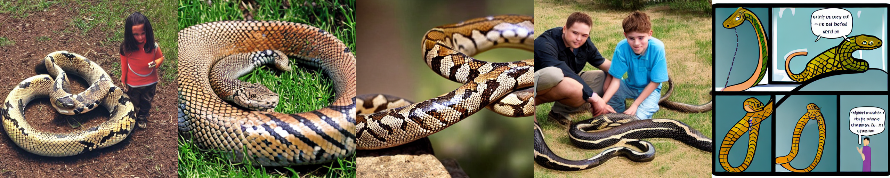
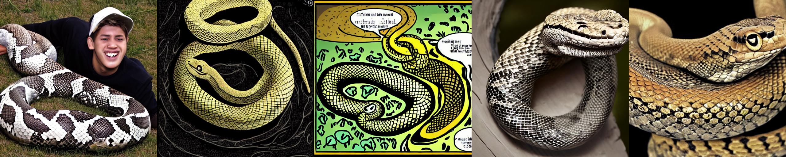

# A Reproduction and Analysis of Query-Free Adversarial Attack Against Stable Diffusion

This project reproduces the core pipeline of the paper *A Pilot Study of Query-Free Adversarial Attack against Stable Diffusion*.  

## Visual Examples

### Example outputs

These examples show that small prompt perturbations can lead to changes in generated outputs, including shifts in style, composition, and semantic details. While the core object category is often preserved, the resulting images may drift toward different visual interpretations.

The main idea is to optimize adversarial prompt suffixes in CLIP text-embedding space and evaluate if these perturbations can shift the generated outputs of Stable Diffusion.

## Objective

The goal of this project is to reproduce the query-free adversarial attack pipeline and analyze how optimized prompt perturbations affect image-text semantic alignment.  
In addition to the main attack settings, this project also includes a small-scale comparison with a random five-character baseline. 

## Experimental Setup

- **Victim model:** Stable Diffusion v1.4  
- **Text encoder:** CLIP text encoder used by Stable Diffusion  
- **Perturbation length:** 5 characters  
- **Attack methods:** Greedy, Genetic, PGD  
- **Additional setting:** semantic-mask setting for the phrase `"and a young man"`  
- **Evaluation prompts:**  
  - `a snake and a young man`  
  - `a red apple on a plate`  
  - `a white swan on a lake`  
  - `a black bicycle against a brick wall`  
- **Metric:** CLIP score between the generated image and the original prompt  
  - Lower CLIP score indicates a stronger attack effect. 

## Results Summary

In the small-scale experiment:

- **Greedy** achieved the lowest average CLIP score: **0.2377**
- **Genetic** followed with **0.2636**
- **PGD** achieved **0.2654**
- **No Attack** was **0.2659**
- **Random** performed worst with **0.2683**

These results support the main claim that optimized perturbations are more effective than arbitrary random corruption.

### Prompt-level observations

- Greedy performed best on 3 out of 4 prompts.
- Genetic performed best on the apple prompt.
- Random never produced the lowest CLIP score.
- The strongest attack effect appeared on:
  - **`a black bicycle against a brick wall`**
- The prompt **`a snake and a young man`** also showed a clear semantic shift under optimized perturbations. 

## Files

- `QF_attack_metadata.ipynb` — notebook version 
- `Report_Yi-Shan Lan.pdf` — short report summarizing objective, setup, results, and conclusions

## Conclusion

This reproduction supports the safety insight that weaknesses in the CLIP text encoder can propagate into downstream image generation.  
It suggests that vulnerabilities in one component of a multimodal system may transfer to later generation stages. 
## Author

Yi-Shan Lan
